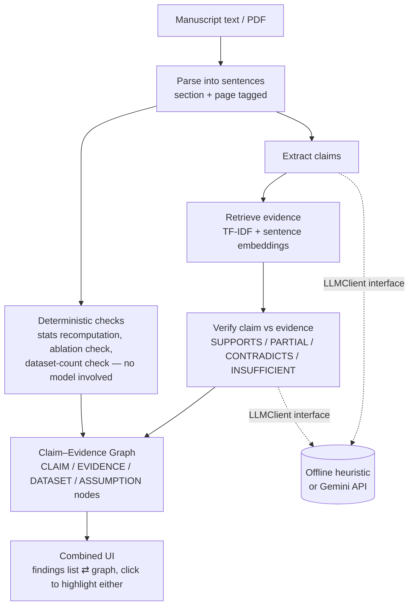

# ETNA — Every Thesis Needs Anchoring

A claim–evidence reviewer for manuscripts. It extracts checkable claims from a
paper, retrieves the manuscript's own evidence for each one, verifies whether
that evidence actually supports it, and runs deterministic checks (recomputed
statistics, missing ablations, single-dataset generalization claims) that
don't rely on a model at all. Every finding is grounded in an explicit
claim → evidence → verdict path, shown as a clickable graph next to the
findings list — nothing is asserted without a traceable reason.

Grounded. Not generated.

## Architecture



The `LLMClient` interface ([reviewer/llm\_client.py](reviewer/llm_client.py))
is the only thing that changes between backends — everything else in the
pipeline is identical either way:

- **Offline** — rule-based (cue phrases + lexical overlap), no API key, no
  network call.
- **Gemini API** — real model judgment; falls back to the offline logic
  per-call if the key is missing, rate-limited, or the request fails.

## Quickstart

```bash
pip install -r requirements.txt
streamlit run app.py
```

Optional — for the Gemini backend, set a key before launching:

```bash
export GEMINI_API_KEY=your_key_here
streamlit run app.py
```

Get a free key at [aistudio.google.com](https://aistudio.google.com).

## Project layout

```
app.py                       Streamlit UI
reviewer/
  models.py                  Shared dataclasses (Sentence, Claim, Evidence, Finding, ...)
  llm_client.py               Offline + Gemini backends behind one interface
  pipeline/
    parse.py                  Sentence/section/page extraction
    retrieval.py               TF-IDF + embedding evidence search
    checkers.py                 Deterministic checks (causal, generalization, ...)
    stats_checker.py             Recomputed statistics checks
    confidence.py                 Confidence scoring
    graph_builder.py               Graph model + the combined findings/graph view
    pdf_ingest.py                   PDF → sentences
```
